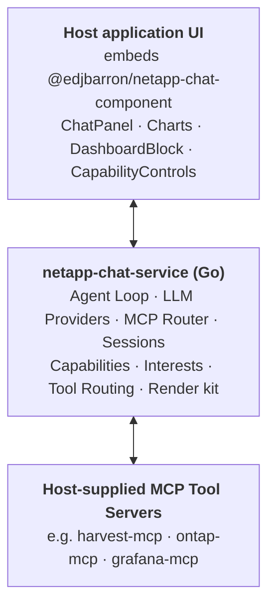
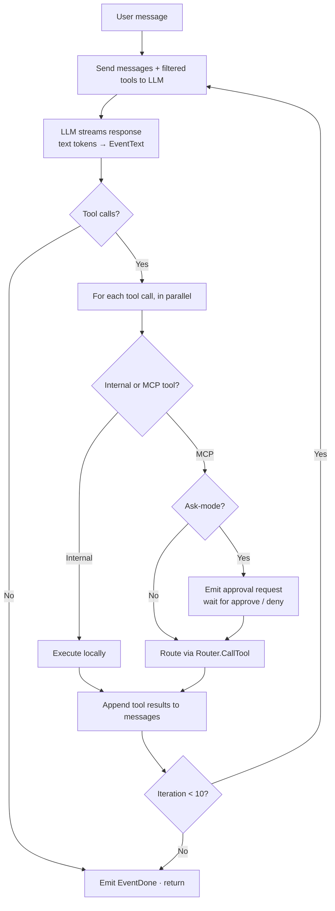
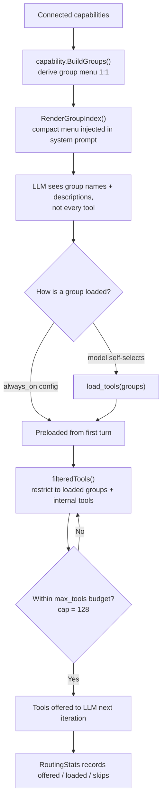
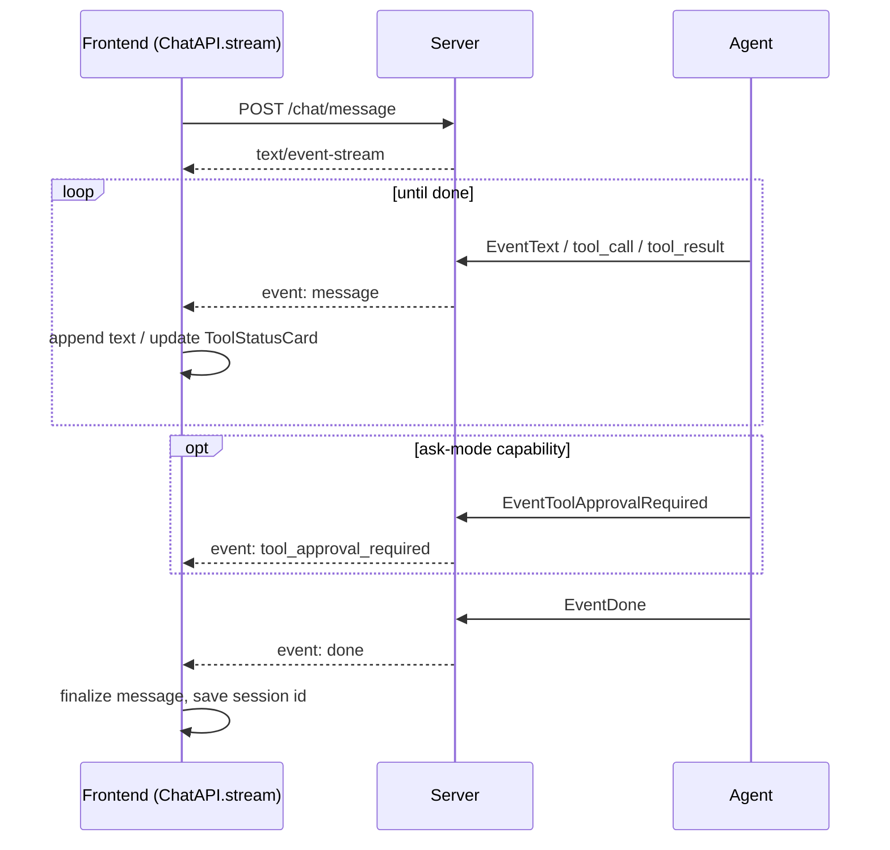
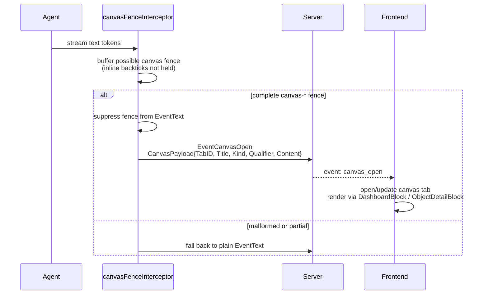
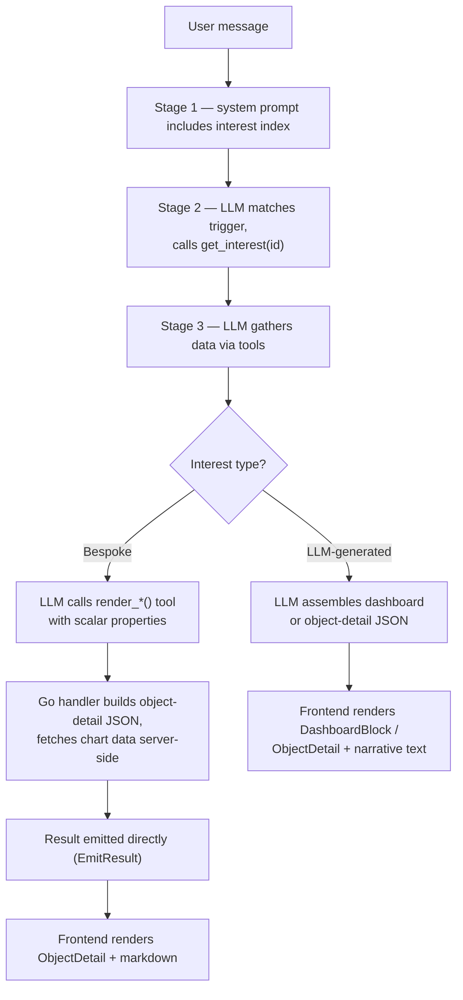
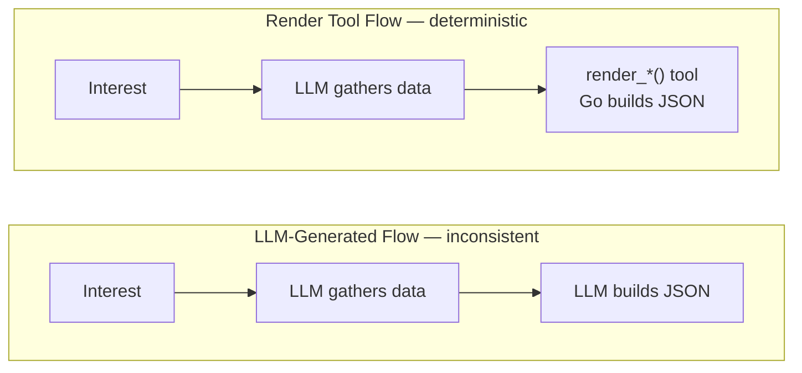
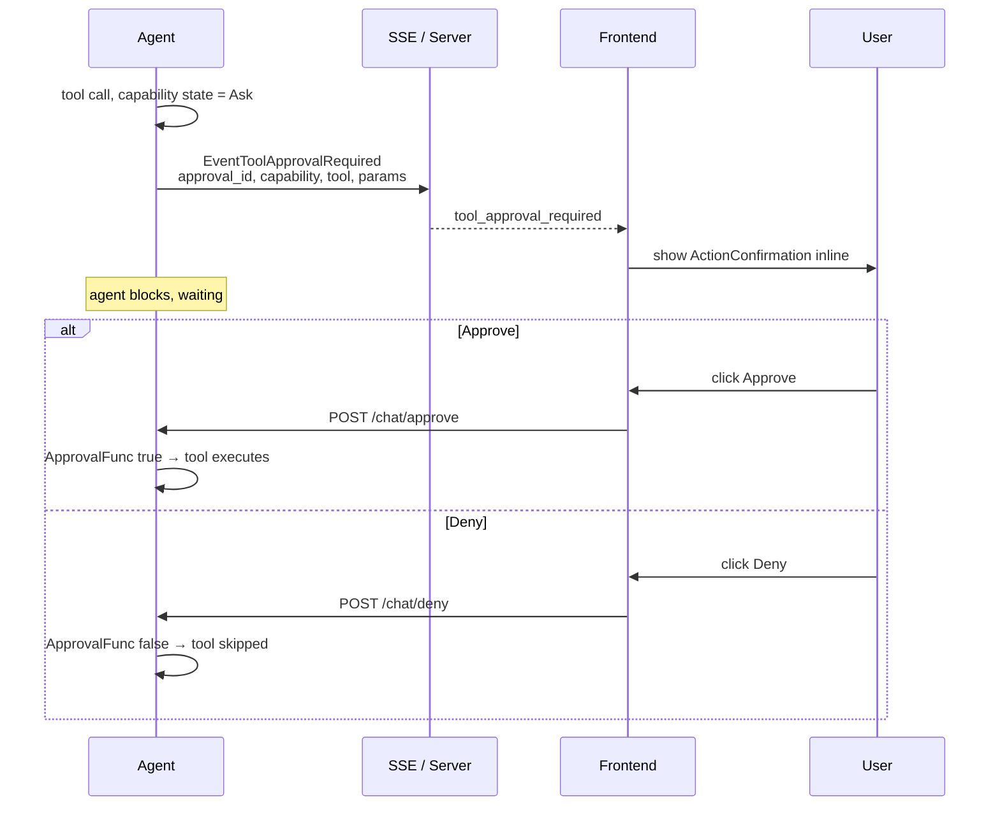
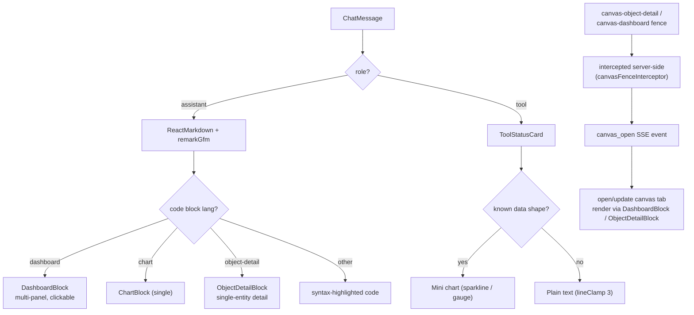

# netapp-chat-service — Chatbot Architecture

> **Status:** Living document — updated as features ship  
> **Audience:** Engineers working on netapp-chat-service and the host applications that embed it  
> **Scope:** Everything in the chat service: backend, the embeddable chat UI component, protocols, type system, interest system, capability controls, tool routing
>
> **`netapp-chat-service` is a host-agnostic, embeddable chatbot service.** It ships
> no product-specific behavior, and it is not aware of which application embeds it.
> A *host application* embeds it — as a Go library or by running the standalone
> server — and injects everything domain-specific through configuration and
> dependencies: the LLM provider, the MCP servers (and their capability states), the
> system-prompt text, the interest catalog, and any bespoke render tools. Any
> domain-flavored examples in this document (e.g. storage metrics, volume detail) are
> illustrative only, not built-in features of the service.

---

## 1. Overview

`netapp-chat-service` is an embeddable, AI-powered chatbot service. The host
application supplies an LLM provider and a set of MCP (Model Context Protocol)
servers; the service runs an agentic tool-use loop, gates tool access behind
per-capability states, and renders rich visual responses — charts, dashboards,
status grids, object-detail cards, action buttons — inline in the chat
conversation (and optionally in a side canvas). Nothing about the domain is baked
in: the host wires in its own MCP servers, prompt text, interests, and render
tools.

The system has three main layers:



**Key design principles:**

- **Host-agnostic core** — the service hardcodes no products, MCP servers, capabilities, interests, or prompt copy. A host application injects all of these via config (standalone server) or `server.ChatDeps` fields (embedded library). The NetApp servers above are an example consumer's wiring.
- **LLM as orchestrator** — the LLM decides which tools to call, how to interpret results, and what visualization format to use. For LLM-generated output the service doesn't pre-process data. For bespoke render tools (§5.6), a host-supplied Go handler builds the output deterministically (and may fetch its own data server-side).
- **Declarative rendering** — the LLM emits typed JSON in fenced code blocks; the UI component dispatches to React components by type. No executable code crosses the wire.
- **Capability-gated tool access** — each MCP server maps to a capability with an Off/Ask/Ask-on-write/Allow state. Users control what the LLM can do.
- **Interest-driven responses** — host-supplied "interests" teach the LLM how to produce rich layouts for common questions, without hardcoding behavior in the service.
- **Tool routing for scale** — optional in-band supervisor (§2.7) keeps the per-turn tool list under the provider cap as the number of MCP servers grows.

---

## 2. Backend Architecture

### 2.1 Startup & Initialization

`cmd/chat-service/main.go` — `initChatbot()` runs at server start:

1. Loads AI configuration from the host-configured path (e.g. `config.yaml`/`ai.yaml`) — provider, API key, model, capability states
2. Creates the LLM provider (OpenAI, Anthropic, Bedrock, or OpenAI-compatible custom endpoint)
3. Connects to the host-configured MCP servers (e.g. harvest-mcp, ontap-mcp, grafana-mcp) — discovers available tools from each
4. Loads the interest catalog the host supplied (host's embedded interests + user-defined from the host's `InterestsDir`)
5. Builds the capability list from the configured servers and merges saved states

> When embedded as a Go library, a host skips the standalone `initChatbot()` and
> instead constructs `server.ChatDeps` directly (provider, router, capabilities,
> catalog, prompt config, extra tools, tool-routing settings).

If no AI configuration exists, the chatbot is disabled — the frontend shows a setup prompt instead of the chat interface.

### 2.2 Agent Loop

`agent/agent.go` — the core orchestration engine.

The `Agent.Run()` function implements an agentic tool-use loop:



**Key behaviors:**

- **Parallel tool execution**: When the LLM requests multiple tools in one response, they execute concurrently.
- **Rate-limit retry**: OpenAI 429 errors trigger automatic retry with parsed delay (up to 2 retries).
- **Safety limit**: After 10 iterations, the agent asks the LLM to summarize with available information rather than looping indefinitely.
- **Ask-mode approval**: For capabilities in Ask state, the agent pauses and emits an `EventToolApprovalRequired` event. The SSE handler holds the connection open until the user approves or denies via a separate API call.

### 2.3 LLM Provider Layer

`llm/` — multi-provider abstraction.

```go
type Provider interface {
    ChatStream(ctx context.Context, req ChatRequest) iter.Seq2[StreamEvent, error]
    ValidateConfig(ctx context.Context) error
    ListModels(ctx context.Context) ([]string, error)
}
```

Supported providers:

| Provider | Implementation | SDK |
|----------|---------------|-----|
| OpenAI | `openai.go` | Official OpenAI Go SDK |
| Anthropic | `anthropic.go` | Official Anthropic Go SDK |
| AWS Bedrock | `bedrock.go` | AWS SDK v2 |
| Custom | `openai.go` (with custom endpoint) | OpenAI-compatible |
| LLM Proxy | `openai.go` (with auth header) | OpenAI-compatible |

All providers implement streaming via `iter.Seq2[StreamEvent, error]` — a Go 1.23 iterator that yields text deltas and tool calls as they arrive from the upstream API.

Configuration is loaded from the host-configured path (e.g. `config.yaml`, or `ai.yaml` on an appliance host):

```yaml
provider: openai
endpoint: https://api.openai.com/v1
api_key: sk-...
model: gpt-4-turbo
capabilities:
  harvest: allow
  ontap: ask
  grafana: off
```

### 2.4 MCP Client Router

`mcpclient/router.go` — manages connections to MCP servers and routes tool calls.

```go
type Router struct {
    servers map[string]*serverConn  // name → connection
    toolIndex map[string]string     // tool name → server name
}
```

Each MCP server exposes a set of tools. The router:

1. **Connects** to each server, opens an MCP session, and discovers its tools
2. **Merges** all tools into a single list for the LLM (the LLM sees a flat tool namespace)
3. **Routes** tool calls to the correct server based on the tool→server index
4. **Handles** disconnection gracefully — tools from disconnected servers are removed from the list

MCP server URLs default to Docker-internal addresses and are overridable via environment variables:

| Server | Default | Env Var |
|--------|---------|---------|
| harvest-mcp | `http://harvest-mcp:8082` | `MCP_HARVEST_URL` |
| ontap-mcp | `http://ontap-mcp:8084` | `MCP_ONTAP_URL` |
| grafana-mcp | `http://grafana-mcp:8085/mcp` | `MCP_GRAFANA_URL` |

### 2.5 Session Management

`session/session.go` — in-memory conversation state.

```go
type Session struct {
    ID        string
    Messages  []llm.Message
    CreatedAt time.Time
    UpdatedAt time.Time
}
```

Sessions use a sliding window to cap context size. When the message count exceeds the maximum, `trimWindow()` removes the oldest non-system messages. Sessions are keyed by a client-generated UUID stored in the frontend.

There is no persistence — sessions are lost on chat-service restart. This is intentional: conversation history is treated as ephemeral (well-suited to appliance-style hosts).

### 2.6 System Prompt

`BuildSystemPrompt()` in `agent.go` constructs a dynamic system prompt from runtime state. The product-specific copy is **not hardcoded** — it comes from the host-supplied `agent.SystemPromptConfig`:

| `SystemPromptConfig` field | Purpose | Default |
|---|---|---|
| `ProductName` | Assistant display name set by the host (e.g. "Acme Assistant") | empty |
| `ProductDescription` | Paragraph describing the product/data-source context | empty |
| `Guidelines` | Product-specific guideline lines (e.g. URL-rewriting rules) | none |
| `Vocabulary` | Free-form markdown block for domain guidance (entity kinds, link patterns, CLI proposal formats) injected before the data-source list | empty (no block) |

The service ships **no role text, guidelines, or vocabulary by default** — a host with an empty config gets a generic assistant. The blocks assembled are:

```
┌─────────────────────────────────────────────┐
│ 1. Role & guidelines (host-supplied)        │
│    - ProductName / ProductDescription        │
│    - Guidelines[] (host-specific rules)      │
│    - Markdown formatting rules (generic)      │
│    - Destructive-operation confirmations      │
│    - Vocabulary block (host-supplied)         │
├─────────────────────────────────────────────┤
│ 2. Connected data sources                   │
│    - List of MCP server names + tool count   │
├─────────────────────────────────────────────┤
│ 3. Chart format spec (if interests loaded)  │
│    - panel types with JSON schemas           │
│    - dashboard/object-detail layout rules     │
├─────────────────────────────────────────────┤
│ 4. Interest catalog (if interests loaded)   │
│    - Compact index table (ID │ Name │ Triggers)│
│    - Match triggers → call get_interest first │
├─────────────────────────────────────────────┤
│ 5. Interest management spec (if save/delete │
│    tools available)                          │
├─────────────────────────────────────────────┤
│ 6. Tool group index (if tool routing on §2.7)│
└─────────────────────────────────────────────┘
```

The chart format spec is a generic string constant (`chartFormatSpec`) documenting the panel types and their JSON schemas. The interest catalog is a dynamic markdown table built from whatever interests the host loaded. Together they give the LLM the vocabulary and instructions to produce structured visual responses — but only when the host has supplied interests.

When **tool routing** is enabled (§2.7), `BuildSystemPromptWithRouting()` injects a sixth block — the capability **group index** — and instructs the model to call `load_tools` before using any grouped tools. When tool routing is off (the default), this block is absent and the prompt is byte-for-byte identical to the legacy `BuildSystemPrompt()` output.

### 2.7 Tool Routing (High Tool-Count Scaling)

As more MCP servers connect, the flattened per-turn tool list grows toward the provider's hard cap (`MaxToolsPerRequest = 128`) and selection accuracy degrades well before that. **Tool routing** — the in-band supervisor — keeps the per-turn tool list small without a dedicated routing-model round trip. It is **opt-in and off by default**; absent configuration, behavior is byte-for-byte identical to before.

How it works (in-band mode):

1. **Group registry** — `capability.BuildGroups()` derives a capability/group menu 1:1 from the connected capabilities (no hardcoded product/view map). Each group's label/description come from optional per-server `capability_name`/`capability_description` config, falling back to the server's tool names. `capability.RenderGroupIndex()` renders this as a compact menu.
2. **Group index in the system prompt** — the menu is injected (§2.6) instead of the full flattened tool schema. The model sees group names + descriptions, not every tool.
3. **`load_tools` internal tool** — the model self-selects the groups it needs by calling `load_tools(groups)`. Only then are those groups' tools loaded into the tool list for subsequent iterations. This is the same in-band "search-then-load" shape the interest system already uses (`get_interest`), not a separate supervisor request. Groups named in the `always_on` config list are preloaded from the first turn without requiring a `load_tools` call. When `group_expand_threshold` is set, a group larger than the threshold is offered tool-by-tool and the model can load just the tools it needs via `load_tools(tools)` instead of the whole server — useful when a single MCP (e.g. an ~80-tool storage server) is too large to pair with others under the cap.
4. **Per-message filtering + budget guard** — `filteredTools()` restricts the offered tools to loaded groups (plus internal tools), recomputed each iteration, and enforces the `max_tools` budget so the request stays under the cap.
5. **Forced-first-step nudge** — in `in-band` mode (on by default) the agent ensures `load_tools` is called before grouped tools are used; if the model skips it, the agent nudges and retries.
6. **Telemetry** — `agent.RoutingStats` (via `(*Agent).LastRoutingStats`) records groups offered/loaded, `load_tools` call count, reloads, and skip/compliant outcomes.



Configuration is via the `tool_routing` block (§10.4):

| Mode | Behavior |
|------|----------|
| `off` | Default. No routing; full filtered tool list as before. |
| `in-band` | In-band supervisor — group index + `load_tools` self-selection. |
| `router` | Dedicated routing model (not yet implemented; parsed but **rejected at startup**). |

This feature is **server-side only** — the chat UI component (`@edjbarron/netapp-chat-component`) is unchanged; `load_tools` appears in the UI like any other internal tool under the existing trace toggle. See `docs/high-tool-count-scaling.md` for the full design, decisions, and deferred work.

---

## 3. Frontend Architecture

### 3.1 Chat Panel

The chat UI is shipped as a reusable React package — `@edjbarron/netapp-chat-component` (`packages/chat-component/src/`) — that the host application embeds. `packages/chat-component/src/ChatPanel.tsx` is the main chat interface, implemented as a Mantine `Drawer` that slides in from the side of the host UI.

**Structure:**

```
ChatPanel (Drawer)
├── Header
│   ├── Title
│   ├── CapabilityControls (popover)
│   ├── ModeToggle (read-only ↔ read-write)
│   └── Clear / Close buttons
├── Message List (ScrollArea)
│   ├── User messages (right-aligned)
│   ├── Assistant messages (left-aligned, markdown-rendered)
│   │   ├── Inline text (ReactMarkdown + remarkGfm)
│   │   ├── code[language=chart] → ChartBlock
│   │   ├── code[language=dashboard] → DashboardBlock
│   │   └── code[other] → syntax-highlighted <code>
│   └── Tool messages → ToolStatusCard
├── Suggested Prompts (when empty)
└── Input Area
    ├── Textarea
    ├── Send button
    └── Stop button (during streaming)
```

### 3.2 State Management

`useChatPanel.ts` — a custom React hook that manages all chat state:

| State | Type | Purpose |
|-------|------|---------|
| `messages` | `ChatMessage[]` | Conversation history |
| `streaming` | `boolean` | Active LLM stream |
| `sessionId` | `string` | Client-generated session UUID |
| `configured` | `boolean` | Whether AI provider is set up |
| `mode` | `"read-only" \| "read-write"` | Current execution mode |
| `modeTimeLeft` | `number \| null` | Read-write auto-disable countdown (10 min) |
| `capabilities` | `Capability[]` | Capability definitions + states |
| `pendingApproval` | `PendingApproval \| null` | Active ask-mode approval |

**Mode system**: Read-write mode must be explicitly activated and auto-disables after 10 minutes. Write-capable tools (action-button execute, save_interest, delete_interest) are only available in read-write mode.

### 3.3 SSE Streaming

The frontend issues the streaming POST through `ChatAPI.stream(path, body, signal)` (default implementation: `fetch()` with the configured `headers`/`credentials`), then reads `response.body` as an SSE stream. Events are parsed line-by-line and dispatched:

| SSE Event | Frontend Action |
|-----------|----------------|
| `message` (type: text) | Append text delta to current assistant message |
| `message` (type: tool_call) | Add ToolStatusCard with "executing" status |
| `message` (type: tool_result) | Update ToolStatusCard with result + optional auto-vis |
| `message` (type: tool_error) | Update ToolStatusCard with error |
| `tool_approval_required` | Show ActionConfirmation inline card |
| `canvas_open` | Open/update a canvas tab, render payload via DashboardBlock / ObjectDetailBlock |
| `error` | Display error message |
| `done` | Finalize message, save session ID |

Text tokens stream incrementally — the user sees the response building in real time. Dashboard blocks are buffered until the closing fence arrives, with an "Assembling dashboard..." placeholder shown during accumulation.



---

## 4. Type System — Chart & Dashboard Panels

The LLM produces structured visual responses by emitting fenced code blocks containing typed JSON. The frontend dispatches each JSON object to a specific React component based on its `type` field.

### 4.1 Panel Types

There are 12 panel types, organized into three categories:

**Data visualization** (wrap Mantine/recharts components):

| Type | Component | Source | Purpose |
|------|-----------|--------|---------|
| `area` | `AreaChartBlock` | `@mantine/charts` AreaChart | Time-series trends |
| `bar` | `BarChartBlock` | `@mantine/charts` BarChart | Comparisons |
| `gauge` | `GaugeBlock` | `@mantine/core` RingProgress | Single utilization value |
| `sparkline` | `SparklineBlock` | `@mantine/charts` Sparkline | Compact inline trend |
| `status-grid` | `StatusGridBlock` | Custom (SimpleGrid + Badge) | Multi-resource health |
| `stat` | `StatBlock` | Custom (Text + Group) | Single prominent value |

**Interest-specific** (custom Mantine compositions):

| Type | Component | Purpose |
|------|-----------|---------|
| `alert-summary` | `AlertSummaryBlock` | Severity count badges (clickable) |
| `resource-table` | `ResourceTableBlock` | Clickable resource list |
| `alert-list` | `AlertListBlock` | Active alerts with severity + time |
| `callout` | `CalloutBlock` | Highlighted recommendation card |
| `proposal` | `ProposalBlock` | Proposed CLI command |
| `action-button` | `ActionButtonBlock` | Execute or conversational buttons |

### 4.2 Rendering Dispatch

Two entry points handle chart JSON:

**Standalone charts** — `ChartBlock.tsx` handles `language-chart` code fences:

```
```chart
{ "type": "area", "title": "...", ... }
```​
```

**Multi-panel dashboards** — `DashboardBlock.tsx` handles `language-dashboard` code fences:

```
```dashboard
{ "title": "Fleet Health", "panels": [ { "type": "area", "width": "half", ... }, ... ] }
```​
```

**Object detail views** — `ObjectDetailBlock.tsx` handles `language-object-detail` code fences:

```
```object-detail
{ "type": "object-detail", "kind": "volume", "name": "vol_prod_01", "sections": [...] }
```​
```

All three components:
1. Parse and validate the JSON using type-specific parsers from `chartTypes.ts`
2. Dispatch each panel/section to the correct renderer component by `type` / `layout`
3. Fall back gracefully — unknown types or malformed JSON render as a plain code block

`DashboardBlock` also manages a responsive CSS grid layout where panels declare their width as `"full"` (100%), `"half"` (50%), or `"third"` (33%).

`ObjectDetailBlock` renders a single-entity detail page: identity header, then a sequence of sections (properties grid, embedded charts, timeline, alert list, actions, text, tables). See `docs/chatbot-object-detail-design.md` for the full schema and navigation paradigm.

### 4.3 Type Inference

`inferChartType()` in `chartTypes.ts` provides shape-based type inference when the LLM omits the `type` field. This handles edge cases where the LLM returns valid panel JSON without an explicit type — common with alert-list, gauge, and status-grid shapes.

The inference logic examines the JSON structure (presence of specific keys, array shapes, value types) and maps it to one of the 12 known types. It is used as a fallback in both `parseChart()` and the inline chart detector.

### 4.4 Inline Chart Detection

`inlineChartDetector.ts` — `wrapInlineChartJson()` handles a common LLM behavior: emitting bare JSON objects in the response text without wrapping them in a fenced code block.

The detector:
1. Scans the assistant message for bare `{...}` JSON objects outside code fences
2. Sanitizes the JSON (strips JS-style comments, trailing commas)
3. Classifies the object: `chart`, `dashboard`, or neither (using `inferChartType()` as fallback)
4. Wraps detected chart/dashboard JSON in the appropriate code fence so ReactMarkdown routes it to the correct renderer

### 4.5 Data Safety

`downsample()` in `chartTypes.ts` is a safety net for large data arrays. If a chart's data array exceeds 200 points, it is downsampled by picking every Nth point. The system prompt also instructs the LLM to limit data to ~50–100 rows.

### 4.6 Canvas Rendering

Inline rendering puts the visual block in the message stream. The **canvas** is an
alternative surface: instead of (or in addition to) flowing inline, content opens
in a pinned side panel with its own tabs, so the user can keep a dashboard or
object-detail view visible while continuing to chat.

Canvas is driven by two additional fence types that mirror the inline ones:

| Inline fence | Canvas fence |
|---|---|
| ` ```object-detail ` | ` ```canvas-object-detail ` |
| ` ```dashboard ` | ` ```canvas-dashboard ` |

**How it works (server side):** the agent wraps its text emit with a
`canvasFenceInterceptor` (`agent/canvas.go`). As tokens stream, the interceptor
buffers anything that might be the start of a canvas fence; mid-content backticks
(inline code) are *not* held. When a complete `canvas-object-detail` /
`canvas-dashboard` block arrives, the interceptor:

1. **suppresses** the fence from the normal `EventText` stream (so it does not also render inline), and
2. emits an `EventCanvasOpen` carrying a `CanvasPayload{ TabID, Title, Kind, Qualifier, Content }`. The `TabID` is derived as `kind::title::qualifier` so re-opening the same object reuses its tab. The `Content` is the raw inner JSON (an ordinary `object-detail` or `dashboard` object).

The server serializes this as a dedicated SSE event — `event: canvas_open` with the
`CanvasPayload` as data (`server/server.go`). Malformed/incomplete fences fall back
to plain text, so a partial stream never corrupts the message.

**Producing canvas blocks:** the LLM can emit a canvas fence directly, or a bespoke
render tool (§5.6) can call `(*render.ObjectDetail).MarshalCanvasBlock()` instead of
`MarshalBlock()` to target the canvas.

**Canvas context in the prompt:** open canvas tabs are fed back to the model.
`BuildSystemPrompt` / `BuildSystemPromptWithRouting` accept variadic
`CanvasTabSummary` values (passed by the server from `req.CanvasTabs`) and append a
"canvas context" section so the LLM knows what the user has pinned and can refer to
or update it.

**Frontend:** the chat UI component (`@edjbarron/netapp-chat-component`) handles
`canvas_open` by opening/updating a canvas tab and rendering the payload with the
same `DashboardBlock` / `ObjectDetailBlock` components used inline (see
`useChatPanel.canvas.test.ts`).



---

## 5. Interest System

Interests are predefined response patterns that teach the LLM how to produce rich, structured responses for common questions. They bridge the gap between "the LLM knows the chart vocabulary" and "the LLM consistently produces the exact layout we want."

**Interests are host-supplied, not built into the service.** The service provides
the *mechanism* (catalog loading, the system-prompt index, the `get_interest` /
`save_interest` / `delete_interest` tools, and the bespoke-render-tool plumbing);
the host application provides the *content*. A host wires its catalog in via
`server.ChatDeps`:

| `ChatDeps` field | Role |
|---|---|
| `Catalog *interest.Catalog` | The loaded interest catalog (built/indexed by the host) |
| `InterestsDir string` | Directory where user-created interests are persisted |
| `ExtraTools map[string]agent.InternalTool` | Host-supplied internal tools, including any bespoke render tools (§5.6) |

A host typically embeds its own interest `.md` files with `//go:embed`, then uses
`interest.ExtractFS(fsys, dir)` to materialize them into a directory that
`interest.Catalog.Load` reads. This repo ships only **generic example interests**
under `interest/examples/` (`health-check.md`, `resource-status.md`,
`object-detail.md`) for reference — they are not loaded by default and carry no
product semantics. If a host supplies no catalog, the interest index and chart
spec are simply omitted from the prompt and the agent behaves as a plain tool-use
assistant.

### 5.1 Concept

An interest is a markdown file with YAML frontmatter:

```markdown
---
id: morning-coffee
name: Fleet Health Overview
source: builtin
triggers:
  - how's everything
  - any issues
  - summary
  - good morning
requires:
  - harvest
---

When the user wants an overall health check, produce a dashboard with:
1. alert-summary (full width) — Call get_active_alerts...
2. area (half width) — Cluster Performance (7d)...
...
```

**Frontmatter** provides metadata for matching and filtering. **Body** provides instructions the LLM follows when producing the response.

### 5.2 Two Tiers

Interests carry a `source` field that puts them in one of two tiers:

**`source: builtin`** — authored by the host application team and shipped in the
host's binary (typically via `//go:embed` + `interest.ExtractFS`). These are
usually **prescriptive**: they specify exact panel types, widths, tool calls, and
layout order. They cannot be deleted by users and their IDs cannot be shadowed by
user interests.

**`source: user`** — created by end users (via chat, or by dropping `.md` files
in the host's `InterestsDir`). These are usually **descriptive** — prose the LLM
interprets to choose panel types and layout. They are capped (max 10) and fully
user-managed.

Within either tier, an interest is either **LLM-generated** (the body tells the
LLM what tools to call and what output JSON to assemble — a `dashboard` or
`object-detail` block) or **bespoke** (the body tells the LLM what data to gather
and which host-supplied render tool to call; a Go tool builds the final JSON —
see §5.6).

> **Illustrative example.** A host might ship a builtin catalog such as a
> fleet-health interest (→ `dashboard`), a resource-status interest, an object-list
> interest, and a bespoke object-detail interest (→ a custom render tool). Those
> interests and their `requires:` capabilities live in the *host's* repo, not in
> netapp-chat-service. They are shown here only to illustrate the patterns.

An interest's output may also include a `toggle` field that renders a clickable
badge next to the title, switching between paired views by injecting a trigger
message for the other interest (e.g. a summary/detailed dashboard pair).

### 5.3 How It Works

The interest catalog flows through the system in three stages:

**Stage 1 — Index in system prompt**: At session start, `BuildSystemPrompt()` includes a compact table of interest IDs, names, and trigger phrases. This costs ~200-600 tokens regardless of catalog size.

**Stage 1.5 — Pre-filter tools by interest** (optional): Before the agent is created, the chat handler attempts a fast substring match of the user message against all interest triggers using `Catalog.Match()`. If a trigger matches, the handler narrows the tool set to only the matched interest's `requires:` capabilities (e.g. an interest that requires only `harvest` excludes all other servers' tools). This reduces the tool schema sent to the LLM on every iteration, improving TTFT. If no trigger matches, the full tool set is sent. See §6.2 for details.

**Stage 2 — LLM matches and retrieves**: When the user sends a message, the LLM checks if it semantically matches any trigger phrase. If so, it calls `get_interest(id)` as its first tool call to retrieve the full interest body. This is a local lookup — no network call.

**Stage 3 — LLM follows instructions**: The LLM reads the interest body, calls the specified tools to gather data, then produces the output. The final step depends on whether the interest is LLM-generated or bespoke:

- **LLM-generated**: The LLM assembles the output JSON itself — a `dashboard` or `object-detail` code block following the layout instructions. For prescriptive (`builtin`) interests, the instructions are precise (specific panel types, widths, queries). For `user` interests, the LLM exercises judgment.

- **Bespoke**: The LLM gathers scalar data (properties, status, etc.) and then calls a host-supplied **render tool** (registered in `ChatDeps.ExtraTools`). The render tool — a Go `InternalTool` — deterministically builds the `object-detail` JSON. The LLM does not assemble the output; Go code does. See §5.6 for details.



### 5.4 Interest Management

Users manage interests through three tools (all require read-write mode):

| Tool | Purpose | Guardrails |
|------|---------|------------|
| `get_interest(id)` | Retrieve interest body | Read-only, any mode |
| `save_interest(...)` | Create or update user interest | Max 10 user interests, no built-in ID shadowing, valid capability refs |
| `delete_interest(id)` | Remove user interest | Cannot delete built-in interests |

The LLM mediates all management actions — when a user says "save a new interest," the LLM infers metadata, drafts the body, shows a preview for confirmation, and only saves after explicit approval.

### 5.5 Implementation

| File | Purpose |
|------|---------|
| `interest/interest.go` | `InterestMeta`, `Interest` types; YAML frontmatter parser |
| `interest/catalog.go` | `Catalog` — load, filter, index, save, delete |
| `interest/embed.go` | `ExtractFS(fsys, destDir)` — materializes a host's embedded interest FS into a directory `Catalog.Load` can read |
| `interest/tool.go` | Tool definitions and handlers for get/save/delete |
| `interest/examples/*.md` | Generic example interests (reference only; not loaded by default) |

### 5.6 Bespoke Render Tools

Bespoke render tools are a host-extensibility mechanism, not a NetApp feature.
Interests can instruct the LLM to gather data and produce structured UI blocks; if
the LLM also assembles the final JSON it occasionally omits sections, forgets
buttons, or varies the layout across sessions. For views that must be exact, the
host supplies a **render tool** instead.

**Bespoke render tools** split the pipeline:

1. The **interest** tells the LLM *what data to gather* and *which render tool to call*.
2. The **render tool** — a Go `agent.InternalTool` the host registers in
   `ChatDeps.ExtraTools` — deterministically builds the `object-detail` JSON from
   the gathered data.

This keeps the flexible, natural-language data-gathering step (which the LLM
excels at) while guaranteeing the final UI is always correct and complete.

**The `render/` package is a generic toolkit, not a set of tools.** It exposes the
Go structs that mirror the TypeScript schema — `ObjectDetail`, `Section`,
`PropertiesData`, `ActionsData`, `AreaChartData`, etc. — plus
`(*ObjectDetail).MarshalBlock()` (→ `object-detail` fence) and
`MarshalCanvasBlock()` (→ `canvas-object-detail` fence, see §4.6). A host builds
its render tools on top of these structs. The service ships **no** concrete render
tool of its own.

**Server-side data (host's choice)**: a render tool may fetch its own data
server-side (e.g. time-series from a metrics store) so the LLM passes only scalar
properties rather than large arrays through tool arguments. How it does so is
entirely host code; the service imposes nothing.



#### Bespoke Interest Inventory (illustrative)

The service ships no bespoke interests. As an illustration, a host might pair a
`volume-detail` interest with a `render_volume_detail` tool that returns a
6-section `object-detail` and fetches IOPS/latency/capacity time-series from its
own metrics store. Everything in this subsection lives in the host's repo.

#### Enforcement Mechanisms

Because LLMs are unreliable at following mandatory tool-call instructions,
bespoke interests use two enforcement flags on the `agent.InternalTool` registration
(both are generic service features, available to any host tool):

| Flag | Purpose |
|------|---------|
| `RequiredAfterInterest` | Names the interest that makes this tool mandatory. When the named interest has been loaded (via `get_interest`), the agent ensures the tool is called before the turn ends. If the LLM finishes with text instead, the agent clears the text, injects a system message ("You MUST call {tool} now"), and retries. |
| `EmitResult` | When `true`, the tool's return value is emitted directly as an `EventText` SSE event — injected into the assistant message stream so the frontend renders it inline. Without this, the tool result would only appear inside a collapsed tool-result card. |

**History pre-scan**: The `RequiredAfterInterest` check works across turns.
At the start of each `Run()` call, the agent scans the message history for
any prior `get_interest` tool calls and seeds the `loadedInterests` map.
This prevents a gap where the LLM reuses interest instructions from a
previous turn without re-calling `get_interest`, which would otherwise
bypass enforcement.

#### When to use a render tool vs. LLM-generated output

| Scenario | Approach |
|----------|----------|
| Single-object detail views with guaranteed sections | **Render tool** — consistency is critical |
| Multi-panel dashboards | **LLM-generated** — layout is simple, variation is acceptable |
| User-defined interests | **LLM-generated** — user controls the output shape |

#### Example Wireframe (host's `render_volume_detail`)

To make the pattern concrete, a host's `render_volume_detail` tool might produce
this guaranteed layout (host code — shown for illustration only):

```
┌──────────────────────────────────────────────────────────┐
│  📦 vol_docs                                    [ok]     │
│  Volume on SVM vdbench, cluster cls1                     │
├──────────────────────────────────────────────────────────┤
│  Properties                                              │
│  ┌────────────────────┬────────────────────┐             │
│  │ State      online  │ Total Size  51.4GB │             │
│  │ Used       89%     │ Aggregate   aggr1→ │             │
│  │ SVM        vdbench→│ Cluster     cls1→  │             │
│  │ Style      FlexVol │ Protocol    NFS    │             │
│  │ Monitoring Active (3 capacity, 3 dp)    │             │
│  └────────────────────┴────────────────────┘             │
├──────────────────────────────────────────────────────────┤
│  Performance (last 24h)                                  │
│  ┌──────────────────────────────────────────┐            │
│  │  📈 IOPS & Latency area chart            │            │
│  │  Series: Read IOPS, Write IOPS, Latency  │            │
│  └──────────────────────────────────────────┘            │
│  (Falls back to "No I/O activity" text when no data)     │
├──────────────────────────────────────────────────────────┤
│  Capacity Trend (30 days)                                │
│  ┌──────────────────────────────────────────┐            │
│  │  📈 Used % area chart                    │            │
│  │  ─ ─ Warning (85%)  ─ ─ Critical (95%)  │            │
│  └──────────────────────────────────────────┘            │
│  (Falls back to "No capacity trend data" text)           │
├──────────────────────────────────────────────────────────┤
│  Active Alerts                                           │
│  ⚠ Volume vol_docs used 89%         2024-01-15 10:30    │
│  (Empty state: no items, section still rendered)         │
├──────────────────────────────────────────────────────────┤
│  Health Analysis                                         │
│  Free-text paragraph written by the LLM describing       │
│  volume health, risks, and recommendations.              │
├──────────────────────────────────────────────────────────┤
│  Actions                                                 │
│  [Stop Monitoring🔒] [Show Snapshots] [Resize Volume]   │
│                                                          │
│  🔒 = requiresReadWrite (disabled in read-only mode)    │
│  Toggle label changes: "Monitor this Volume" when off    │
└──────────────────────────────────────────────────────────┘
```

**Key guarantees:**
- Always exactly 6 sections in this order
- Monitoring button always present with correct toggle label
- `requiresReadWrite` always set on monitoring buttons
- Empty data gracefully falls back to text sections
- Property links (→) inject follow-up chat messages

#### Implementation Files

| File | Owner | Purpose |
|------|-------|---------|
| `render/render.go` | **service** | Generic toolkit: Go structs mirroring the TypeScript `ObjectDetailData` schema + `MarshalBlock` / `MarshalCanvasBlock` |
| `agent/agent.go` (`InternalTool`) | **service** | `ExtraTools` registration, `RequiredAfterInterest` / `EmitResult` enforcement |
| host repo (e.g. `render/volume.go`) | host | The concrete `render_volume_detail` tool: `VolumeInput` → `render.ObjectDetail` |
| host repo (e.g. `interests/volume-detail.md`) | host | Interest body instructing the LLM to call the render tool |
| host wiring (`ChatDeps.ExtraTools`) | host | Registers the render tool with the service |

---

## 6. Capability System

Capabilities gate LLM access to MCP tool servers. Each MCP server maps to one capability with three states:

| State | Behavior |
|-------|----------|
| **Off** | Tools from this server are excluded from the LLM's tool list. The LLM doesn't know they exist. |
| **Ask** | Tools are visible to the LLM, but each call pauses for user approval before executing. |
| **Allow** | Tools execute autonomously — no user intervention required. |

### 6.1 Capability Definitions (host-supplied)

The service defines **no** capabilities of its own — `capability.DefaultCapabilities()`
returns nil. Each capability is derived from a host-configured MCP server: the host
lists its servers (in `config.yaml` for the standalone server, or by populating
`ChatDeps.Capabilities` when embedding) and the service maps each server 1:1 to a
capability with an `id`, label/description, and an initial state.

As an example, a NetApp host might define:

| Capability ID | Server | Description | Initial State |
|---------------|--------|-------------|---------------|
| `harvest` | harvest-mcp | Infrastructure metrics, health monitoring, capacity analysis | Ask |
| `ontap` | ontap-mcp | Volume lifecycle, snapshots, data protection, multi-cluster management | Ask |
| `grafana` | grafana-mcp | Dashboard search, Prometheus queries, alert rules, panel images | Ask |

A different host would define an entirely different set; nothing above is built in.

### 6.2 How Filtering Works

Tool filtering happens in two stages: **pre-filtering** (before agent creation) and **capability filtering** (inside the agent loop). When tool routing is enabled, a third stage — **group routing** (§2.7) — further narrows the capability-filtered list to the groups the model loads via `load_tools`.

#### Pre-filtering by Interest

Before the agent is created, the chat handler attempts to match the user's message against interest triggers using `Catalog.Match()`. If a trigger matches, the handler narrows `capStates` to only the capabilities the matched interest requires — all other capabilities are set to Off. This reduces the tool schema sent to the LLM on every iteration (e.g. ~42 tools → ~15 for harvest-only interests), improving time-to-first-token.

If no trigger matches, no pre-filtering is applied — the full tool set is available.

#### Capability Filtering in the Agent

When the agent prepares to call the LLM, `filteredTools()` builds the tool list:

1. Gets all tools from the MCP router
2. Maps each tool to its server, then to the corresponding capability
3. Excludes tools whose capability is Off (including any set Off by pre-filtering)
4. For Ask-state tools, the agent's `ApprovalFunc` gates execution at call time
5. Internal tools (get_interest, save_interest, delete_interest, and — when routing is enabled — load_tools) are appended after filtering
6. Tools marked `ReadWriteOnly` (save_interest, delete_interest) are excluded unless mode is read-write
7. When **tool routing** is enabled (§2.7), the capability-filtered list is further restricted to the groups the model has loaded via `load_tools`, recomputed each iteration and capped by the `max_tools` budget

### 6.3 Ask-Mode Approval Flow



### 6.4 Frontend Controls

`CapabilityControls.tsx` renders a popover accessible from the chat header:

- Per-capability segmented control (Off | Ask | Allow)
- Availability indicator (gray when MCP server is disconnected)
- Tool count badge
- "Show tool traces" toggle — displays ToolStatusCards for tool execution visibility

---

## 7. API Surface

All endpoints are under `/`.

### 7.1 Chat Endpoints

| Method | Path | Purpose |
|--------|------|---------|
| `POST` | `/chat/message` | Send message, receive SSE stream |
| `DELETE` | `/chat/session` | Clear session history |
| `GET` | `/chat/capabilities` | Get capability definitions + states |
| `POST` | `/chat/capabilities` | Update capability states |
| `POST` | `/chat/approve` | Approve ask-mode tool call |
| `POST` | `/chat/deny` | Deny ask-mode tool call |

### 7.2 AI Configuration Endpoints

| Method | Path | Purpose |
|--------|------|---------|
| `GET` | `/ai/config` | Get current LLM config (API key masked) |
| `POST` | `/ai/config` | Save LLM config, reinitialize chatbot |
| `DELETE` | `/ai/config` | Remove config, disable chatbot |
| `POST` | `/ai/test` | Validate LLM connection |
| `POST` | `/ai/models` | List available models from provider |

### 7.3 SSE Protocol

`POST /chat/message` returns `text/event-stream`:

```
event: message
data: {"type":"text","content":"Let me check..."}

event: message
data: {"type":"tool_call","tool":"get_active_alerts","params":{},"capability":"harvest","status":"executing"}

event: message
data: {"type":"tool_result","tool":"get_active_alerts","result":"{...}"}

event: message
data: {"type":"text","content":"```dashboard\n{...}\n```"}

event: done
data: {"type":"done","session_id":"abc-123"}
```

Event types:

| Event | Data Fields | When |
|-------|-------------|------|
| `message` (text) | `content` | Streamed text tokens |
| `message` (tool_call) | `tool`, `params`, `capability`, `status` | Tool starts executing |
| `message` (tool_result) | `tool`, `result` | Tool succeeded |
| `message` (tool_error) | `tool`, `error` | Tool failed |
| `tool_approval_required` | `approval_id`, `capability`, `tool`, `params`, `description` | Ask-mode pause |
| `canvas_open` | `tab_id`, `title`, `kind`, `qualifier`, `content` | Canvas fence interceptor detected a complete `canvas-object-detail` / `canvas-dashboard` block (§4.6) |
| `error` | `message` | Fatal error |
| `done` | `session_id` | Stream complete |

---

## 8. Tool Visualization

### 8.1 ToolStatusCard

Every tool execution renders a `ToolStatusCard` in the message list. It shows:
- Tool name and capability
- Execution status (executing → completed / failed)
- Auto-visualization of results when applicable (sparkline from time-series data, gauge from capacity data)
- Toggle between chart view and raw JSON

The "Show tool traces" toggle in CapabilityControls controls whether ToolStatusCards are visible. When hidden, tool calls execute silently and only the final assistant text (and charts) are shown.

### 8.2 Auto-Visualization Heuristics

`detectToolViz()` in `ToolStatusCard.tsx` examines tool result JSON:
- Array of objects with timestamp + numeric fields → inline sparkline
- Single object with value + max → mini gauge
- Otherwise → plain text (collapsed at 3 lines)

This provides lightweight visualization even when the LLM doesn't produce a formal chart block.

---

## 9. Rendering Pipeline — End to End

LLM output is rendered through several paths. Most render **inline** in the message
stream; one renders on the **canvas** side panel (§4.6):



**Inline paths** (rendered in the message stream by the assistant-markdown branch):

- **Dashboard blocks** (interest-driven): Multi-panel grid with clickable elements that inject follow-up chat messages.
- **Standalone chart blocks**: Single chart inline in the message.
- **Object-detail blocks**: Single-entity detail page (identity header + sections) via `ObjectDetailBlock`.
- **ToolStatusCard auto-visualization**: Automatic detection of chartable data in tool results — no LLM formatting needed.

**Canvas path** (§4.6): A `canvas-object-detail` / `canvas-dashboard` fence is not rendered inline. The agent's `canvasFenceInterceptor` intercepts it server-side, suppresses it from the text stream, and emits a `canvas_open` SSE event. The frontend opens (or updates) a canvas tab and renders the payload with the same `DashboardBlock` / `ObjectDetailBlock` components used inline.

Additionally, `wrapInlineChartJson()` preprocesses assistant messages to catch bare JSON that should have been in a code fence, wrapping it so the inline dashboard/chart paths can handle it.

---

## 10. Configuration & Environment

> The concrete paths, env vars, and proxy/auth details below reflect one example
> appliance-style host. Other hosts (e.g. an embedded library consumer) wire the
> same settings through their own config files or `server.ChatDeps` fields.

### 10.1 AI Configuration

Stored at the host-configured path (e.g. `/etc/<host>/ai.yaml`, or the path from `AI_CONFIG_PATH`):

```yaml
provider: openai          # openai | anthropic | bedrock | custom | llm-proxy
endpoint: https://api.openai.com/v1
api_key: sk-...
model: gpt-4-turbo
user: ""                  # optional, for llm-proxy
aws_region: ""            # bedrock only
aws_access_key: ""        # bedrock only
aws_secret_key: ""        # bedrock only
capabilities:
  harvest: allow
  ontap: ask
  grafana: off
```

### 10.2 MCP Server URLs

| Env Var | Default | Server |
|---------|---------|--------|
| `MCP_HARVEST_URL` | `http://harvest-mcp:8082` | harvest-mcp |
| `MCP_ONTAP_URL` | `http://ontap-mcp:8084` | ontap-mcp |
| `MCP_GRAFANA_URL` | `http://grafana-mcp:8085/mcp` | grafana-mcp |

### 10.3 Dev Environment

- `scripts/dev-start.sh` / `scripts/dev-stop.sh` — start/stop the full dev stack
- MCP servers in dev: harvest(8084), ontap(8085), grafana(8086)
- Vite dev proxy: `/api` → `localhost:8080` (chat-service), harvest-proxy routes → `localhost:8083`
- Dev-mode auth: `FakeAuthMiddleware` accepts `admin/Netapp01`

### 10.4 Tool Routing

Tool routing (§2.7) is configured via the `tool_routing` block (off by default). Per-server `capability_name`/`capability_description` label and describe each capability in the routing menu (auto-derived from tool names when omitted):

```yaml
tool_routing:
  mode: in-band             # off (default) | in-band | router (rejected until implemented)
  max_tools: 64             # optional cap on the post-routing tool list (0 = no extra cap)
  group_expand_threshold: 25 # groups larger than this are offered tool-by-tool so the model
                             # can load individual tools from a big server (0 = whole-group only)
  always_on:                # group IDs loaded from turn 1 without the model calling load_tools
    - jira

mcp_servers:
  - name: jira
    url: http://jira-mcp:8090
    capability_name: "Jira"
    capability_description: "Issue tracking: search, create, transition issues"
```

---

## 11. Security Model

> Sections 11.1–11.4 and 11.7–11.8 describe how one **example appliance-style host**
> secures the service — scoped tokens, JWT sessions, Caddy forward-auth, appliance
> filesystem. They are illustrative; another host secures it differently.
> The chatbot-specific controls (11.5 capability gating, 11.6 read-write mode, 11.9
> declarative rendering) are provided by the service itself and apply to every host.

An example host application uses a layered security model with scoped tokens, JWT sessions, and capability-gated tool access. The chatbot inherits the host's auth infrastructure and adds chatbot-specific controls on top.

### 11.1 Authentication Stack

All `/` routes — including all chat and AI configuration endpoints — pass through a middleware chain:

```
Request
  │
  ├── BasicAuthMiddleware  — checks username/password against /etc/shadow
  ├── JWTAuthMiddleware    — checks X-Token / X-Token-Refresh cookies (HMAC-signed)
  ├── tokens.AuthMiddleware — checks Bearer token against hashed token file
  ├── ConfirmAuthMiddleware — rejects if none of the above succeeded
  └── RequireScopeMiddleware("chat-service-API") — enforces scope on Bearer tokens
```

Three authentication methods, tried in order:

| Method | Mechanism | When Used |
|--------|-----------|-----------|
| **Basic Auth** | Username + password validated against `/etc/shadow` | Initial login, API scripts |
| **JWT** | HMAC-signed cookies (`X-Token` 5min, `X-Token-Refresh` 20min) | Web admin sessions (after initial Basic Auth login) |
| **Bearer Token** | SHA-256 hashed token checked against token file | Programmatic API access, MCP client access |

JWT tokens are issued after successful Basic Auth and auto-refresh via the `X-Token-Refresh` cookie. The web admin session is stateless — no server-side session store for the HTTP auth layer. (Chat sessions are separate — see §2.5.)

### 11.2 Scoped Tokens

The host issues API tokens that are **scoped** to specific services and optionally **restricted to specific clusters**. Token storage is a flat file of SHA-256 hashes with tab-separated metadata:

```
<sha256-hash>    <name>    <scopes>    <clusters>
```

**Scopes** control which services a token can access:

| Scope | Grants Access To |
|-------|-----------------|
| `chat-service-API` | chat-service admin API (all `/` routes) |
| `Harvest-MCP` | Harvest MCP server (via Caddy `forward_auth`) |
| `ONTAP-MCP` | ONTAP MCP server (via Caddy `forward_auth`) |
| `Grafana-MCP` | Grafana MCP server (via Caddy `forward_auth`) |
| `harvest-proxy` | harvest-proxy REST API |
| `harvest-proxy-Proxy` | harvest-proxy metrics proxy |
| `VictoriaMetrics` | VictoriaMetrics query API |
| `Node-Exporter` | Node exporter metrics |
| `*` | Wildcard — all scopes |

A token created with `scopes: ["ONTAP-MCP"]` can access ontap-mcp through Caddy but cannot call the chat-service admin API or any other MCP server.

**Cluster restrictions** further limit what ONTAP clusters a token can operate on:

```json
{ "name": "team-a", "scopes": ["ONTAP-MCP", "harvest-proxy"], "clusters": ["clusterA", "clusterB"] }
```

This token can only query data for `clusterA` and `clusterB` — requests targeting other clusters are rejected. Clusters default to `["*"]` (all clusters) when not specified. Cluster enforcement uses `IsValidWithCluster()` which checks both scope and cluster in one call.

### 11.3 Caddy Forward Auth

The host application uses Caddy as its reverse proxy. Each backend service route is protected by Caddy's `forward_auth` directive, which sends a subrequest to chat-service's `/auth` endpoint with:

- `X-Forwarded-Uri` — the original request path
- `X-Required-Scope` — the scope tag assigned to that route

chat-service's `ForwardAuthHandler` checks the Bearer token against the required scope. This means **external MCP client access** (e.g., Claude Desktop connecting to `/mcp/ontap/`) is scope-gated at the Caddy layer — a `Harvest-MCP` token cannot reach the ONTAP MCP endpoint.

```
External client → Caddy → forward_auth → chat-service /auth → scope check
                    │
                    └── scope OK → reverse_proxy → MCP container
```

**Guest access bypass**: Monitoring scopes (`VictoriaMetrics`, `Node-Exporter`, `harvest-proxy`, `harvest-proxy-Proxy`) can be opened without tokens when `VM_GUEST_ACCESS=true` is set, allowing read-only monitoring integrations.

### 11.4 Chatbot Internal MCP Access

The chatbot in chat-service connects to MCP containers **directly on the Docker network** (e.g., `http://harvest-mcp:8082`) — not through Caddy. This is internal container-to-container communication with no token auth on the wire.

This is secure because:
- MCP containers are on an isolated Docker network — not exposed externally
- External access goes through Caddy → `forward_auth` → scoped token check (§11.3)
- The chatbot's tool access is further gated by the capability system (§11.5)

### 11.5 Capability Controls

On top of authentication, the chatbot has its own authorization layer via capabilities. Each MCP server maps to a capability with three states:

| State | Effect |
|-------|--------|
| **Off** | Tools from this server are excluded from the LLM's tool list entirely. The LLM doesn't know they exist. |
| **Ask** | Tools are visible but each call pauses for explicit user approval before executing. |
| **Allow** | Tools execute autonomously. |

All capabilities default to **Ask** — the user must explicitly opt into autonomous execution. Capability states are persisted in `/etc/<host>/ai.yaml` under the `capabilities` map and survive restarts.

This gives users fine-grained control: they can allow Harvest (read-only metrics queries) to run freely while keeping ONTAP (which has write operations like volume creation) in Ask mode.

### 11.6 Read-Write Mode & Action Confirmation

The `<ChatPanel>` opens in **read-write mode by default** (configurable via the `defaultMode` prop — hosts can pass `defaultMode="read-only"` to start safer). Write-capable operations require:

1. **Mode is read-write**: User can toggle to read-only at any time in the UI; if started in read-only, they must explicitly switch to read-write
2. **Auto-disable timer**: Read-write mode automatically reverts to read-only after 10 minutes
3. **Action confirmation**: Even in read-write mode, `action-button` execute commands and interest management tools (`save_interest`, `delete_interest`) go through a confirmation flow — the LLM shows what it intends to do and waits for approval

These layers stack: a destructive ONTAP operation requires (a) the ONTAP capability to be Ask or Allow, (b) read-write mode to be active, and (c) user approval of the specific action.

> The default was changed from read-only to read-write in chat-component 0.1.7. The backend filters tools by mode based on each MCP tool's `ToolAnnotations.ReadOnlyHint`; servers that don't yet emit annotations have all their tools dropped in read-only mode, which made the previous default unusable for those deployments. Once your MCP servers are fully annotated, hosts that want stricter defaults can opt back in via `<ChatPanel defaultMode="read-only" />`.

### 11.7 LLM API Key Security

- API keys are stored in `/etc/<host>/ai.yaml` on the appliance filesystem (root-owned)
- `GET /ai/config` masks the key before returning it to the frontend — the full key is never sent to the browser after initial configuration
- Keys are never logged (structured logging deliberately excludes credential fields)
- Keys are sent only to the configured LLM endpoint over HTTPS

### 11.8 Grafana Service Account Provisioning

The Grafana MCP needs a service account token to query Grafana. chat-service auto-provisions this at startup via the Grafana HTTP API:

1. Creates a `Viewer`-role service account (read-only — cannot modify dashboards or settings)
2. Generates a token for the service account
3. Writes the token to `.env.custom` so Docker Compose injects it into the `grafana-mcp` container
4. Restarts `grafana-mcp` to pick up the token

The Viewer role is deliberately minimal — the MCP can query dashboards and metrics but cannot create, modify, or delete anything in Grafana.

### 11.9 Declarative Rendering

The LLM emits typed JSON, not executable code. The frontend renders it through type-dispatched React components. There is no `eval()`, no dynamic script injection, no HTML rendering from LLM output. Malformed JSON falls back to a plain code block — the worst case is unrendered text, not code execution.

### 11.10 Security Summary

```
Layer                     What It Protects              How
─────────────────────     ──────────────────────────    ────────────────────────────
Caddy forward_auth        External MCP access           Scoped Bearer tokens
chat-service auth middleware    Admin API + chat endpoints    Basic Auth / JWT / Bearer token
RequireScopeMiddleware    API route access               chat-service-API scope check
Cluster restrictions      Multi-tenant data isolation   Token-level cluster list
Capability Off/Ask/Allow  LLM tool access               User-controlled per-MCP
Read-write mode           Destructive operations        Manual toggle + 10min timer
Action confirmation       Individual write actions      Inline approval flow
Grafana SA provisioning   Grafana data access           Viewer-role (read-only)
Declarative rendering     Frontend code execution       Type-dispatched JSON, no eval
```

---

## 12. File Index

### Backend (Go)

| File | Lines | Purpose |
|------|-------|---------|
| `cmd/chat-service/main.go` | ~250 | Startup, MCP connections, capability init |
| `server/server.go` | ~400 | SSE streaming, session management, ask-mode |
| `config/config.go` | ~300 | LLM config CRUD, model discovery, validation |
| `agent/agent.go` | ~900 | Agentic tool-use loop, `SystemPromptConfig`, tool filtering, tool routing (load_tools, group filtering, RoutingStats), `InternalTool` enforcement |
| `agent/canvas.go` | ~220 | Canvas fence interceptor (`canvas-object-detail`/`canvas-dashboard` → `EventCanvasOpen`) |
| `llm/provider.go` | ~150 | Provider interface, config types |
| `llm/openai.go` | ~250 | OpenAI/custom provider |
| `llm/anthropic.go` | ~250 | Anthropic provider |
| `llm/bedrock.go` | ~200 | AWS Bedrock provider |
| `mcpclient/router.go` | ~350 | Multi-server MCP routing |
| `session/session.go` | ~150 | In-memory sessions, sliding window |
| `capability/capability.go` | ~120 | Off/Ask/Allow state model; `DefaultCapabilities()` returns nil (host-supplied) |
| `capability/group.go` | ~120 | Tool-routing group registry (`BuildGroups`, `BuildGroupsExpanding`, `RenderGroupIndex`) |
| `interest/interest.go` | ~80 | Interest types, frontmatter parser |
| `interest/catalog.go` | ~280 | Catalog loading, filtering, indexing, save/delete |
| `interest/tool.go` | ~280 | get/save/delete tool handlers |
| `interest/embed.go` | ~30 | `ExtractFS` — materialize a host's embedded interest FS into a directory |
| `interest/examples/*.md` | — | Generic example interests (reference only; not loaded by default) |
| `render/render.go` | ~130 | Generic render toolkit: `ObjectDetail`/`Section`/chart structs + `MarshalBlock`/`MarshalCanvasBlock` |

> Concrete render tools (e.g. `render_volume_detail`), product interest files, and
> data integrations (metrics, alert rules) live in the **host application's** repo,
> not here.

### Frontend (TypeScript/React)

Shipped as the `@edjbarron/netapp-chat-component` package under `packages/chat-component/src/`.

| File | Lines | Purpose |
|------|-------|---------|
| `ChatPanel.tsx` | ~300 | Main chat drawer, message rendering, markdown integration |
| `useChatPanel.ts` | ~400 | State management, SSE streaming (incl. `canvas_open`), mode/approval/capability state |
| `charts/ObjectDetailBlock.tsx` | ~150 | Single-entity object-detail renderer (inline + canvas) |
| `CapabilityControls.tsx` | ~90 | Off/Ask/Allow toggles, tool traces toggle |
| `ModeToggle.tsx` | ~40 | Read-only ↔ read-write with countdown |
| `ActionConfirmation.tsx` | ~80 | Ask-mode approval inline card |
| `ToolStatusCard.tsx` | ~120 | Tool execution status + auto-vis |
| `inlineChartDetector.ts` | ~200 | Bare JSON detection + code fence wrapping |
| `charts/chartTypes.ts` | ~300 | TypeScript interfaces, parsers, type inference |
| `charts/ChartBlock.tsx` | ~100 | Single chart dispatcher |
| `charts/DashboardBlock.tsx` | ~150 | Multi-panel grid layout |
| `charts/AreaChartBlock.tsx` | — | Mantine AreaChart wrapper |
| `charts/BarChartBlock.tsx` | — | Mantine BarChart wrapper |
| `charts/GaugeBlock.tsx` | — | Mantine RingProgress wrapper |
| `charts/SparklineBlock.tsx` | — | Mantine Sparkline wrapper |
| `charts/StatusGridBlock.tsx` | — | Custom SimpleGrid + Badge |
| `charts/StatBlock.tsx` | — | Big number display |
| `charts/AlertSummaryBlock.tsx` | — | Clickable severity badges |
| `charts/ResourceTableBlock.tsx` | — | Clickable resource table |
| `charts/AlertListBlock.tsx` | — | Alert detail list |
| `charts/CalloutBlock.tsx` | — | Recommendation card |
| `charts/ProposalBlock.tsx` | — | Proposed command display |
| `charts/ActionButtonBlock.tsx` | — | Execute/message action buttons |

---

## 13. Related Documents

- **Design Spec**: `docs/chatbot-design-spec.md` — original design covering MCP deployment, BYO LLM, backend API, frontend UI, capability controls, security, and phasing
- **Graphical UI Enhancements**: `docs/chatbot-graphical-ui-enhancements.md` — interest system design, chart type catalog, rendering architecture, implementation plan with milestones
- **Object-Detail Design**: `docs/chatbot-object-detail-design.md` — interest/type layering, the `object-detail` code fence type, navigation paradigm (dashboard → drill-down → detail), and the alerts lighthouse use case
- **High Tool-Count Scaling**: `docs/high-tool-count-scaling.md` — strategies for keeping the per-request tool list under the provider cap as MCP servers grow; the implemented in-band supervisor (§2.7), read-only footprint reduction, intra-group tool-level selection (`group_expand_threshold`), and the offline routing-evaluation harness; plus deferred strategies (host-supplied context hints and a dedicated routing model)
